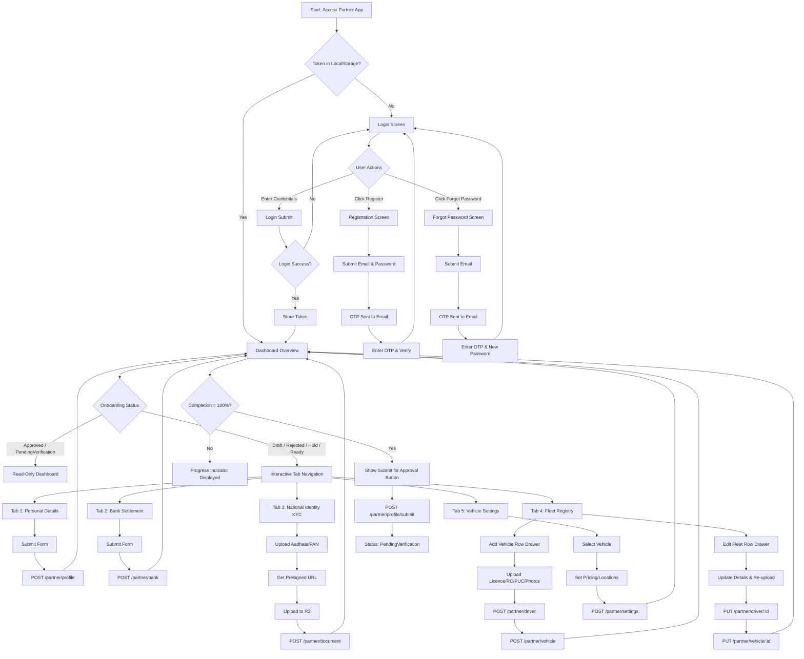

# Mobile Application Analysis & Technical Implementation Plan (Phase 1)

This document provides a comprehensive technical analysis of the existing Partner Onboarding flow from the web application (`frontend/`) and details the architecture, schemas, and API contracts from the backend (`backend/`). It maps out the blueprint for implementing the new isolated mobile application (`mobile/`) using React Native and TypeScript, ensuring zero changes or disruption to the production web and server components.

---

## User Review Required

> [!IMPORTANT]
> **Zero Modification Policy**: This mobile application is fully client-side and acts strictly as a consumer of existing REST APIs. No backend or database schema modifications will be made.
>
> **Asset Assets Cache**: Assets like `/partner/mbconnect.avif` and `/partner/bgimage.avif` must be bundled as static assets (`.png` or `.svg`) in the mobile project or hosted on a CDN.
>
> **Location Selection Strategy**: The web app uses Next.js server actions (`country-state-city` library) to get states and cities. Since mobile cannot use server actions and the backend location endpoints are locked behind Admin auth, the React Native app will bundle `country-state-city` locally.

---

## Open Questions

> [!NOTE]
> We have no open questions that block the design. The existing APIs and schemas provide 100% of the required data structure for the Partner flow.

---

## Current Web Architecture

The current web architecture utilizes:
- **Framework**: Next.js App Router.
- **State Management**: React `useState` & `useEffect` hook-based local state.
- **Routing**: Folder-based file routing with layout templates.
- **API Fetching**: Native `fetch` API directly querying backend REST endpoints.
- **Location Database**: Next.js Server Actions importing `country-state-city` to service dropdown lists.
- **Storage**: `window.localStorage` to persist the JWT token (`partner_token`).

---

## Complete Onboarding Flow Diagram



---

## Screen Inventory

| Screen ID | Screen Name | Stack | Description | UI Elements / Forms |
| :--- | :--- | :--- | :--- | :--- |
| `SCR_AUTH_LOGIN` | Login Screen | `AuthStack` | Authenticates partners, hosts forgot password and reset flows. | Inputs: Email, Password, OTP (reset), New Password. Submit button. |
| `SCR_AUTH_REG` | Registration | `AuthStack` | Registers new accounts and verifies email via OTP. | Inputs: Email, Password, OTP (registration). Register button. |
| `SCR_DASH_MAIN` | Dashboard Overview | `MainTabs` | Main landing page displaying onboarding progress, active stats, verification status, and submission logs. | Header, Status banner, Metric cards, Log history button, Submit button. |
| `SCR_PROFILE_PERS` | Personal Details | `OnboardingStack` | Updates full name, mobile number, partner type, and address. | Profile picture selector (Camera/Library), Inputs: Full Name, Mobile, Partner Type selector, Agency Name, Address, State/City dropdowns, Pincode. |
| `SCR_PROFILE_BANK` | Bank Details | `OnboardingStack` | Configures weekly payout bank settlements. | Inputs: Account Holder Name, Bank Name, Branch, Account Number, IFSC. |
| `SCR_PROFILE_KYC` | KYC Documents | `OnboardingStack` | Uploads National Identity Cards (Aadhaar, PAN). | File selectors (Aadhaar Front, Aadhaar Back, PAN). Document status list. |
| `SCR_PROFILE_FLEET` | Fleet Registry | `OnboardingStack` | Displays registered vehicle-driver pairs. | List of rows. CTA to add row, detail action. |
| `SCR_FLEET_ADD` | Add Fleet Row | `OnboardingStack` | Form to register a vehicle and assign/create a driver concurrently. | Forms: Driver Details (Name, Mobile, License, License Doc) + Vehicle Details (Brand, Model, Name, Category, Seats, Reg No) + Docs (RC, PUC, Insurance, Permit) + Photos (Front, Rear, Left, Right, Interior, Boot). |
| `SCR_FLEET_EDIT` | Fleet Detail & Edit | `OnboardingStack` | Detailed view of a fleet row for edits, file re-uploads, and review. | Detailed view of vehicle and driver fields, view document URLs, re-upload fields. |
| `SCR_VEH_SETTINGS` | Vehicle Settings List | `OnboardingStack` | Lists vehicles configured for pricing and duty hubs. | List of registered vehicles showing configuration status. |
| `SCR_VEH_CONFIG` | Vehicle Configuration | `OnboardingStack` | Adjusts per-km rates, full-day rates, and target duty locations. | Pricing inputs (Per Km, Full Day), Hub list, add location modal, State/City selectors. |

---

## API Inventory

### 1. Authentication
* **`POST /partner/auth/register`**
  - Payload: `{ email, password }`
  - Response: `{ success: true, message: string }`
* **`POST /partner/auth/verify-otp`**
  - Payload: `{ email, otp }`
  - Response: `{ success: true, message: string }`
* **`POST /partner/auth/login`**
  - Payload: `{ email, password }`
  - Response: `{ success: true, accessToken: string }`
* **`POST /partner/auth/forgot-password`**
  - Payload: `{ email }`
  - Response: `{ success: true, message: string }`
* **`POST /partner/auth/reset-password`**
  - Payload: `{ email, otp, newPassword }`
  - Response: `{ success: true, message: string }`

### 2. Onboarding & Profile Updates (Bearer Auth Required)
* **`GET /partner/profile/dashboard`**
  - Response: Dashboard state including profile, address, bank, completion percentage, auth (status), logs (history), vehicles, and drivers.
* **`POST /partner/profile`**
  - Payload: `{ profileData: { fullName, mobileNumber, partnerType, agencyName, profilePicture }, addressData: { addressLine, city, state, pincode } }`
* **`POST /partner/bank`**
  - Payload: `{ bankData: { accountHolderName, bankName, branchName, accountNumber, ifsc } }`
* **`POST /partner/driver`**
  - Payload: `{ name, mobile, licenceNumber, licenceImageUrl }`
* **`PUT /partner/driver/:driverId`**
  - Payload: `{ name, mobile, licenceNumber }`
* **`POST /partner/vehicle`**
  - Payload: `{ vehicleData: { brand, model, vehicleName, category, seatingCapacity, registrationNumber, assignedDriverId } }`
* **`PUT /partner/vehicle/:vehicleId`**
  - Payload: `{ vehicleData: { brand, model, vehicleName, category, seatingCapacity, registrationNumber, FRONT_IMAGE, RC_IMAGE, etc. } }`
* **`POST /partner/document`**
  - Payload: `{ ownerType, ownerId, documentType, fileUrl }`
* **`POST /partner/profile/submit`**
  - Response: `{ success: true, message: string }`
* **`GET /partner/settings`**
  - Response: `{ success: true, settings: { vehicleConfigs } }`
* **`POST /partner/settings`**
  - Payload: `{ vehicleConfigs: [ { vehicleId, perKmRate, fullDayRate, locations: [ { address, city, state, pincode } ] } ] }`

### 3. Upload Service
* **`POST /upload/cloudflare-url`**
  - Payload: `{ fileName, fileType, folder: "partner-documents" }`
  - Response: `{ uploadUrl: string, fileUrl: string }`

---

## Validation Inventory

- **Aadhaar Front/Back / PAN / License Scans**: Must be populated. Only PDF or Image file formats accepted.
- **Mobile numbers**: Exactly 10 digits (`/^[0-9]{10}$/`).
- **IFSC code**: 11-digit alphanumeric pattern matching Indian banking code (`/^[A-Z]{4}0[A-Z0-9]{6}$/`).
- **Vehicle registration plate**: Custom pattern (e.g. `DL1CA1234`) converted to uppercase.
- **Seating Capacity**: Integer values > 0.
- **Rates**: Numeric pricing >= 0.

---

## Navigation Map

```
RootNavigator (Zustand checks partner_token)
├── AuthNavigator (token is null)
│   ├── LoginScreen (SCR_AUTH_LOGIN)
│   └── RegisterScreen (SCR_AUTH_REG)
└── PartnerAppNavigator (token exists)
    └── MainTabs (Bottom Tabs)
        ├── Tab 1: DashboardOverview (SCR_DASH_MAIN)
        ├── Tab 2: ProfileCompletion (Progress list & sub-screens)
        │   ├── PersonalDetails (SCR_PROFILE_PERS)
        │   ├── BankDetails (SCR_PROFILE_BANK)
        │   ├── KYCDocuments (SCR_PROFILE_KYC)
        │   ├── FleetRegistry (SCR_PROFILE_FLEET)
        │   │   ├── AddFleetRow (SCR_FLEET_ADD)
        │   │   └── FleetRowEdit (SCR_FLEET_EDIT)
        │   └── VehicleSettings (SCR_VEH_SETTINGS)
        │       └── VehicleConfigDetail (SCR_VEH_CONFIG)
        └── Tab 3: Settings (General details / Change Password)
```

---

## Migration Risks & Mobile-Specific Implementations

| Feature | Web Implementation | Mobile Specific (React Native) |
| :--- | :--- | :--- |
| **Document/Photo Uploads** | Standard `<input type="file">` utilizing browser-based File blobs. | Uses native picker interfaces (`react-native-document-picker` or `react-native-image-crop-picker`) which return absolute URIs. Form payloads must be constructed manually or sent via binary streams. |
| **Secure Token Storage** | `window.localStorage` | `react-native-mmkv` securely encrypted local persistence. |
| **Address States & Cities** | Next.js Server Action (`country-state-city`) | Bundled pure-JS library instance on the client. |
| **Forms & State Handling** | HTML5 native `FormData(e.currentTarget)` | Controlled inputs managed by `react-hook-form` and validated with `zod`. |
| **Camera Access** | Web-based HTML5 canvas / video elements. | Native Camera module access (`react-native-vision-camera` or `react-native-image-crop-picker`). |

---

## Proposed Folder Structure

A new folder `mobile/` will be created with a clean feature-based layout:

```
mobile/
├── android/
├── ios/
├── src/
│   ├── api/             # Axios client, base configurations, & interceptors
│   ├── assets/          # Local icons, vectors, and background images
│   ├── components/      # UI components (Button, Input, Dropdown, Loader, Camera)
│   ├── config/          # Environment variables (API Base URLs, CDN URLs)
│   ├── constants/       # Theme colors, spacing values, font configs
│   ├── features/        # Feature modules
│   │   ├── auth/        # Login, registration, OTP validations
│   │   ├── partner/     # Personal info, banking, KYC, fleet drawers
│   │   └── customer/    # Reserved for future customer stack
│   ├── hooks/           # Custom React hooks (useAuth, useLocation)
│   ├── navigation/      # React Navigation Stacks and Tab configurations
│   ├── screens/         # Layout view screens
│   ├── store/           # Zustand stores (Auth, active configs)
│   ├── theme/           # UI Palette styling (colors, sizes, layout shapes)
│   ├── types/           # TypeScript interfaces and endpoints definitions
│   ├── utils/           # Formatters (currency, plates, numbers)
│   └── validation/      # Zod validation schemas
```

---

## Technical Implementations

### 1. State Management Strategy
- **Global Auth & UI State**: Managed via **Zustand** for lightweight storage (Token validation, role check, and active drawer status).
- **Server Syncing & Querying**: Managed via **TanStack Query (React Query)** to handle caching, background refetches of dashboard data, optimistic updates, and invalidations on edits.

### 2. Offline Considerations
- Cache the latest dashboard response payload (`GET /partner/profile/dashboard`) in secure storage.
- If the app is opened offline, show cached dashboard data with a banner indicating "Offline Mode - Read Only". Disable submit actions when network connectivity is lost.

### 3. File Upload Strategy
1. Request a presigned URL by hitting `POST /upload/cloudflare-url` with `{ fileName, fileType, folder: "partner-documents" }`.
2. Perform a binary `PUT` upload directly using Axios to the Cloudflare R2 bucket (`uploadUrl`) with the appropriate headers.
3. Save the document reference back to the server using `POST /partner/document` or `PUT /partner/vehicle/:id`.

---

## Verification Plan

### Automated Tests
Once code generation begins:
- Run TypeScript compiler verification checks:
  ```bash
  npx tsc --noEmit
  ```
- Run ESLint to guarantee standard guidelines:
  ```bash
  npx eslint .
  ```

### Manual Verification
- Deploy to physical test simulators (iOS Simulator & Android Emulator) and complete the onboarding flow step-by-step.
- Verify that R2 uploads successfully transmit images from the camera.
- Check state persistence upon force-quitting and reopening the application.
